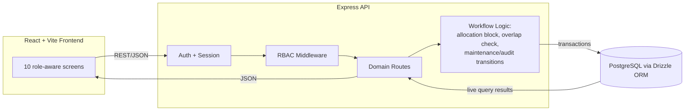
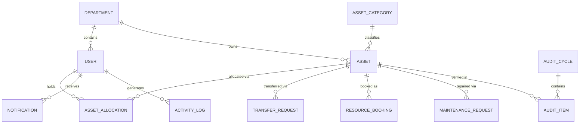

# AssetFlow

**Enterprise Asset & Resource Management System** — built in an 8-hour hackathon sprint.

AssetFlow centralizes how organizations track, allocate, and maintain physical assets and shared resources — replacing spreadsheets and paper logs with structured lifecycles, conflict-safe allocation, and real-time visibility into who holds what, where it is, and its condition.

---

## Table of Contents

- [Problem Statement](#problem-statement)
- [Key Features](#key-features)
- [Tech Stack](#tech-stack)
- [Architecture](#architecture)
- [Database Schema](#database-schema)
- [Getting Started](#getting-started)
- [Demo Credentials](#demo-credentials)
- [Project Structure](#project-structure)
- [API Overview](#api-overview)
- [For Judges — Quick Verification Checklist](#for-judges--quick-verification-checklist)
- [Team & Contribution](#team--contribution)
- [Development Process & Commit Discipline](#development-process--commit-discipline)
- [Known Limitations / Out of Scope](#known-limitations--out-of-scope)
- [License](#license)

---

## Problem Statement

Any organization with equipment, furniture, vehicles, or shared spaces (offices, schools, hospitals, factories, agencies) needs to know who has what, whether a shared room/resource is free, and whether an asset is due for maintenance or overdue for return. AssetFlow delivers this as a single ERP module — asset lifecycle, allocation, resource booking, maintenance workflow, and audit cycles — without touching purchasing, invoicing, or accounting.

Full product spec: see [`AssetFlow_PRD.md`](./AssetFlow_PRD.md).

---

## Key Features

- **Role-based access control** — Admin, Asset Manager, Department Head, Employee, each with distinct permissions enforced server-side (not just hidden UI).
- **Non-self-elevating accounts** — public signup creates an Employee account only; roles are promoted exclusively by an Admin from the Employee Directory.
- **Asset lifecycle tracking** — Available → Allocated → Reserved → Under Maintenance → Lost/Retired/Disposed, with every transition driven by an actual workflow action, never set directly.
- **Double-allocation block** — attempting to allocate an already-held asset is rejected server-side, names the current holder, and offers a Transfer Request instead of a dead end.
- **Booking overlap validation** — shared/bookable resources reject overlapping time-slot requests; back-to-back bookings are correctly allowed.
- **Maintenance approval workflow** — Pending → Approved/Rejected → Technician Assigned → In Progress → Resolved, with the asset's status auto-updating on approval and resolution.
- **Audit cycles** — scoped by department/location, multi-auditor assignment, auto-generated discrepancy report, and a transactional "Close Cycle" that cascades missing items to `Lost` status.
- **Live dashboard & reports** — KPIs, overdue-return alerts, utilization and maintenance-frequency analytics — all computed from live database queries, not static fixtures.
- **Tamper-evident activity log** — each log entry is hash-chained to the previous one, with a "Verify Integrity" check to detect tampering.
- **Notifications** — asset assignment, approvals, booking confirmations/cancellations, overdue alerts, and audit discrepancies all surface in a unified feed.

---

## Tech Stack

| Layer | Choice |
|---|---|
| Frontend | React (Vite) + TypeScript + Tailwind CSS |
| Backend | Node.js + Express + TypeScript |
| Database | PostgreSQL |
| ORM | Drizzle ORM (schema-as-code + migrations) |
| Auth | express-session + bcrypt (no third-party auth provider) |
| Validation | Zod |
| Charts | Recharts |
| Design System | Custom dark/hazard-accent system — see [`design.md`](./design.md) |

No paid or rate-limited third-party APIs are required to run or demo the app.

---

## Architecture



All business rules (double-allocation block, booking overlap, workflow transitions, audit-close cascade) live server-side. The frontend never decides these outcomes — it only renders what the API returns.

---

## Database Schema

Full DDL is in [`AssetFlow_PRD.md`](./AssetFlow_PRD.md) §7 and mirrored in `/db/schema.ts` (Drizzle). Core entities:



Design notes: every workflow (allocation, transfer, booking, maintenance, audit) has its own table rather than overloading `assets` with workflow columns — deliberate 3NF discipline, not an oversight.

---

## Getting Started

```bash
# 1. Clone
git clone <repo-url>
cd assetflow

# 2. Install dependencies
npm install

# 3. Configure environment
cp .env.example .env
# Set DATABASE_URL to your Postgres instance (Replit provisions this automatically)
# Set SESSION_SECRET to any random string

# 4. Run migrations
npm run db:migrate

# 5. Seed demo data (departments, employees, assets, bookings, maintenance requests, one admin)
npm run db:seed

# 6. Start the app (backend + frontend)
npm run dev
```

The app will be available at `http://localhost:5000` (or the Replit-assigned URL). Backend runs on `/api/*`, frontend serves the React app.

---

## Demo Credentials

Seeded by `npm run db:seed`:

| Role | Email | Password |
|---|---|---|
| Admin | `admin@assetflow.dev` | `AssetFlow@2026` |

Additional employee/manager/department-head accounts are seeded with predictable emails (`employee1@assetflow.dev`, etc.) — see `db/seed.ts` for the full list and passwords.

> Change or rotate these before any real deployment. They exist purely for hackathon demo purposes.

---

## Project Structure

```
assetflow/
├── client/                  # React + Vite frontend
│   ├── src/
│   │   ├── pages/            # 10 screens (Dashboard, OrgSetup, Assets, Allocation, Booking, Maintenance, Audit, Reports, Notifications, Auth)
│   │   ├── components/       # Shared UI (pills, cards, tables, kanban board, forms)
│   │   ├── lib/               # API client, theme tokens
│   │   └── theme/             # Tailwind config extension matching design.md
├── server/                  # Express + TypeScript backend
│   ├── routes/                # Domain route handlers (assets, allocations, bookings, maintenance, audits, reports)
│   ├── middleware/            # Auth + RBAC
│   ├── services/              # Business logic (allocation block, overlap check, workflow transitions, hash-chain)
│   └── db/
│       ├── schema.ts           # Drizzle schema (source of truth, mirrors PRD §7)
│       ├── migrate.ts
│       └── seed.ts
├── AssetFlow_PRD.md         # Full product requirements document
├── AssetFlow_Replit_Build_Prompt.md   # Build prompt used to scaffold the app
├── design.md                 # Design system this UI follows
└── README.md                 # You are here
```

---

## API Overview

Full endpoint list in [`AssetFlow_PRD.md`](./AssetFlow_PRD.md) §8. Grouped summary:

```
/auth/*              signup, login, logout, session check
/departments, /categories, /users     org setup (admin-gated writes)
/assets               register, search/filter, detail + history
/allocations           allocate (409 on conflict), return
/transfer-requests      request, approve, reject
/bookings              create (409 on overlap), cancel
/maintenance-requests   raise, approve/reject, assign technician, resolve
/audit-cycles           create, verify item, close (transactional cascade)
/reports/*             utilization, maintenance frequency, idle assets, booking heatmap
/notifications, /activity-logs
```

---

## For Judges — Quick Verification Checklist

A fast way to see the core business logic actually enforced, not just described:

1. **Double-allocation block:** Log in as an Asset Manager, allocate any `Available` asset to an employee. Try to allocate the same asset to a different employee — the app blocks it, names the current holder, and offers a Transfer Request instead of failing silently.
2. **Booking overlap validation:** Book a shared resource (e.g. a meeting room) for a time slot. Try to book the same resource for an overlapping slot — rejected. Try a slot that starts exactly when the first ends — accepted.
3. **Role enforcement:** Log in as an Employee and attempt to hit an admin-only or asset-manager-only action directly via the API (not just the hidden UI button) — it returns 403.
4. **Maintenance → asset status coupling:** Approve a maintenance request and check the asset's status flips to `Under Maintenance` automatically; resolve it and confirm it reverts to `Available`.
5. **Audit close cascade:** Mark an audit item `Missing`, close the audit cycle, and confirm the underlying asset's status becomes `Lost` — done as a single transaction, not a manual follow-up step.
6. **Activity log integrity:** Use the "Verify Integrity" action on the Activity Log screen to confirm the hash chain is intact.

---

## Team & Contribution

| Member | Focus Area | Key Modules |
|---|---|---|
| _[Name]_ | Database & Auth | Schema, migrations, seed data, session auth, RBAC middleware |
| _[Name]_ | Backend Workflows | Allocation/transfer logic, booking overlap logic, maintenance & audit endpoints, activity log hash-chain |
| _[Name]_ | Frontend Core | Design system setup, layout shell, Dashboard, Org Setup, Asset Directory |
| _[Name]_ | Frontend Workflows | Allocation/Transfer UI, Booking calendar, Maintenance kanban, Audit UI, Reports, Notifications |

*(Fill in names before submission — this table doubles as the map judges use to cross-reference commit authorship against module ownership.)*

---

## Development Process & Commit Discipline

This project was built in a single 8-hour sprint (9 AM–5 PM) by a 4-person team. To keep the git history a genuine, checkable record of who built what (not a single end-of-day dump):

- **Commit cadence:** every member commits at least once per hour, scoped to a single logical change.
- **Commit message convention** ([Conventional Commits](https://www.conventionalcommits.org/)):
  - `feat: add booking overlap validation`
  - `fix: correct double-allocation 409 response shape`
  - `chore: seed demo maintenance requests`
  - `docs: update README setup steps`
  - `refactor: extract RBAC check into middleware`
- **Branching:** short-lived feature branches (`feat/booking-overlap`, `feat/audit-cycle-ui`) merged into `main` every 1–2 hours, or direct-to-`main` commits if the team prefers speed over review overhead — either is fine, but pick one and stay consistent.
- **Why this matters here:** GitHub activity (commit frequency, message quality, branch usage) is an explicit judging input for this round — treat the commit log itself as a deliverable, not just the running app.

---

## Known Limitations / Out of Scope

Deliberately deferred to protect the 8-hour timeline — documented here rather than left unexplained:

- No real file/photo upload — asset and maintenance-request photos use a plain URL field.
- No QR-code camera scanning — asset lookup is text/tag search only.
- No email delivery — notifications are in-app only.
- No password-reset email flow — UI stub only.
- No drag-and-drop on the Kanban board or booking calendar — status changes are button-driven.
- No automated test suite — verified via the manual checklist above.
- "AI insights" on the Reports screen are rule-based heuristics (idle-asset detection, keyword-based maintenance priority), not a trained model — stated plainly rather than oversold.
- Activity-log tamper-evidence uses a hash chain, not a distributed ledger — a scoped, honest analog to "blockchain," not a literal blockchain integration.

Full rationale for these cuts: see [`AssetFlow_PRD.md`](./AssetFlow_PRD.md) §12 (MoSCoW).

---

## License

Built for hackathon evaluation purposes. Add a license here if the project continues past the event (MIT is a reasonable default for hackathon code).
