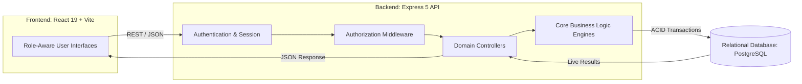
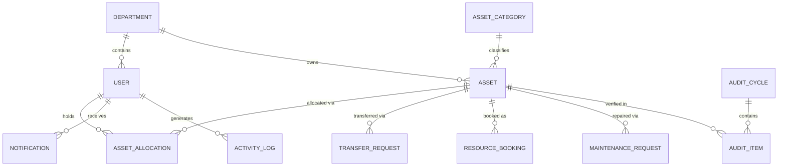

# AssetFlow: Enterprise Asset & Resource Management System

An advanced, scalable Enterprise Resource Planning (ERP) module dedicated to physical asset and shared resource management, engineered during an 8-hour hackathon sprint. 

AssetFlow eliminates ad-hoc spreadsheets and paper logs by introducing structured lifecycles, conflict-proof allocation mechanisms, and real-time visibility into asset custody, location, and condition.

---

## Table of Contents

- [Executive Summary](#executive-summary)
- [Key Capabilities](#key-capabilities)
- [System Architecture](#system-architecture)
- [Technical Stack](#technical-stack)
- [Database Schema](#database-schema)
- [Deployment & Setup](#deployment--setup)
- [Application Interfaces (API)](#application-interfaces-api)
- [Jury Evaluation Checklist](#jury-evaluation-checklist)
- [Team Contributions](#team-contributions)
- [Development Methodology](#development-methodology)
- [Scope & Limitations](#scope--limitations)

---

## Executive Summary

Organizations managing physical equipment, vehicles, and shared facilities face constant challenges tracking resource custody and utilization. AssetFlow resolves this by providing a unified, centralized platform focusing strictly on the operational lifecycle. It encompasses asset allocation, resource booking, maintenance workflows, and rigorous audit cycles, operating entirely independently of external purchasing or accounting systems.

For full product specifications, refer to [`AssetFlow_PRD.md`](./AssetFlow_PRD.md).

---

## Key Capabilities

### Core Operations
- **Role-Based Access Control (RBAC):** Granular access tiers (Admin, Asset Manager, Department Head, Employee) enforced via server-side middleware.
- **Strict Privilege Escalation Prevention:** Public registration yields standard Employee accounts. Role elevation is strictly an administrative function.
- **Deterministic Asset Lifecycle:** Assets transition through discrete states (Available, Allocated, Reserved, Under Maintenance, Retired/Lost) strictly driven by workflow events, preventing manual data corruption.

### Advanced Automation & AI
- **AI-Powered Natural Language Search:** Integrated Large Language Model (Groq Llama 3) translates complex natural language queries (e.g., "Show available laptops in the IT department") into structured, optimized database queries via the Smart Search interface.
- **Predictive Maintenance Diagnostics:** An integrated AI diagnostic engine classifies maintenance issues by priority and suggests immediate troubleshooting procedures based on user descriptions.
- **Dynamic QR Integration:** Automated generation of QR codes for immediate physical-to-digital asset reconciliation.

### Workflow Integrity
- **Conflict-Safe Allocation Guard:** Server-side validation prevents double-allocation of resources. If an asset is occupied, the system provides a transparent Transfer Request workflow rather than a generic error.
- **Booking Overlap Prevention:** Time-slot requests for shared resources are rigorously validated against existing schedules, supporting continuous back-to-back bookings while strictly rejecting overlaps.
- **Maintenance State Machine:** Requests follow a strict approval hierarchy (Pending, Approved, Technician Assigned, In Progress, Resolved), automatically coupling the physical asset status to the maintenance lifecycle.

### User Experience & Reporting
- **Theming & UI Polish:** Comprehensive UI system supporting dynamic Light, Dark, and System-preference themes for optimal accessibility and user comfort.
- **Contextual Detail Interface:** Slide-over panels present deep metadata, QR codes, and full maintenance histories without disrupting the user's primary workflow.
- **Real-Time Analytics:** Dashboards render live KPIs, utilization metrics, overdue return alerts, and idle asset detection directly from dynamic database queries.
- **Export & Auditing:** One-click CSV report exports and departmental audit cycles featuring automatic discrepancy handling and transactional cascade updates.
- **Cryptographic Activity Log:** System actions are recorded with SHA-256 hash-chaining to ensure tamper-evident audit trails.

---

## System Architecture

AssetFlow employs a decoupled, highly scalable Client-Server architecture utilizing a monorepo structure. All critical business logic operates strictly within the server environment.



### Component Breakdown
- **Frontend SPA (`artifacts/assetflow/`):** React, Vite, Tailwind CSS. Focuses purely on presentation and state rendering.
- **REST API (`artifacts/api-server/`):** Express 5, TypeScript. Enforces all business logic (overlap checks, double-allocation blocks).
- **Database Layer (`lib/db/`):** Drizzle ORM managing a PostgreSQL connection pool.
- **API Interfaces (`lib/api-spec/` & `lib/api-client-react/`):** OpenAPI 3.1 specifications generating Zod validation schemas and strongly-typed React Query hooks.

---

## Technical Stack

| Component | Technology |
|---|---|
| **Frontend Framework** | React 19 (Vite) + TypeScript + Tailwind CSS |
| **Backend Framework** | Node.js + Express 5 + TypeScript |
| **Database** | PostgreSQL |
| **ORM & Migrations** | Drizzle ORM |
| **Authentication** | express-session + bcrypt (Native, Offline) |
| **API Contract & Client** | OpenAPI 3.1 + Orval (React Query & Zod Generation) |
| **Artificial Intelligence** | Groq SDK (`llama3-8b-8192`) |
| **Data Visualization** | Recharts |
| **QR Code Generation** | `qrcode` (Server-side DataURL rendering) |
| **Theming Engine** | `next-themes` (Light/Dark mode) |
| **Repository Management** | pnpm workspaces |

> **Requirement:** The AI capabilities require a valid API key (`GROQ_API_KEY` in `.env`). All other subsystems operate entirely isolated and offline.

---

## Database Schema

Designed with strict Third Normal Form (3NF) discipline. Workflows utilize dedicated tables to ensure absolute referential integrity rather than relying on mutable asset columns.



---

## Deployment & Setup

```bash
# 1. Clone Repository
git clone <repository-url>
cd assetflow

# 2. Install Workspace Dependencies
npm install

# 3. Environment Configuration
cp .env.example .env
# Populate DATABASE_URL with your PostgreSQL connection string
# Populate SESSION_SECRET with a cryptographic random string

# 4. Execute Schema Migrations
npm run db:migrate

# 5. Populate Initial Dataset
npm run db:seed

# 6. Initialize Development Servers
npm run dev
```

The application is accessible at `http://localhost:5000` (or designated environment URL). 

### Demo Credentials

Generated by the seed script for immediate testing:

| Access Level | Email Address | Password |
|---|---|---|
| System Administrator | `admin@assetflow.dev` | `AssetFlow@2026` |

*(Standard employee and manager accounts are also generated; refer to `db/seed.ts` for the complete manifest. Ensure all credentials are rotated for production environments).*

---

## Application Interfaces (API)

Extensive documentation is provided in the PRD. Key endpoint domains include:

- `/auth/*` - Session management and authentication
- `/users` - Directory listing, role promotion, lifecycle management
- `/assets` - Registration, telemetry, history, and detail fetching
- `/assets/smart-search` - LLM-powered natural language queries
- `/assets/:id/qrcode` - Dynamic QR code generation
- `/allocations` - Assignment mechanics and conflict resolution
- `/bookings` - Scheduling and overlap validation
- `/maintenance-requests` - Lifecycle transitions and diagnostic generation
- `/audit-cycles` - Compliance checks and transactional closures
- `/reports/*` - Aggregation for operational analytics

---

## Jury Evaluation Checklist

To verify the integrity and sophistication of the implemented business logic:

1. **Double-Allocation Prevention:** Authenticate as an Asset Manager. Allocate an `Available` asset to an Employee. Attempt to allocate the same asset to a different Employee. Observe the deterministic failure, exposure of the current holder, and the proposed Transfer Request workflow.
2. **Booking Overlap Rejection:** Schedule a shared resource. Attempt to schedule a time slot that overlaps. Observe the system rejection. Book an immediately adjacent slot and observe successful scheduling.
3. **Strict Privilege Segregation:** Authenticate as a standard Employee. Attempt to execute an administrative API endpoint via direct cURL/Postman injection. Observe the HTTP 403 Forbidden response.
4. **State Machine Integrity:** Approve a Maintenance Request. Verify the associated asset's status automatically updates to `Under Maintenance`. Resolve the request and confirm restoration to `Available`.
5. **Transactional Audit Cascade:** During an active Audit Cycle, designate an item as `Missing`. Close the audit cycle. Verify the underlying asset status automatically cascades to `Lost` within a unified database transaction.
6. **Cryptographic Trail Verification:** Navigate to the Activity Log and execute the "Verify Integrity" sequence to mathematically prove the event timeline has not been manipulated.

---

## Team Contributions

| Team Member | Domain Responsibility | Implemented Modules |
|---|---|---|
| *[Name]* | Architecture & Security | Database schema, Drizzle migrations, authentication strategies, RBAC middleware |
| *[Name]* | Backend Engineering | Conflict resolution algorithms (allocations/bookings), state machine transitions, cryptographic logging |
| *[Name]* | Frontend Architecture | UI/UX foundational design, Layout routing, Dashboard analytics, Asset Directory interfaces |
| *[Name]* | Workflow Integration | Maintenance Kanban implementation, Booking calendar interfaces, AI search integration, Theme switching |

---

## Development Methodology

Constructed within a strict 8-hour parameter, adhering to professional software engineering standards:

- **Continuous Integration Cadence:** Granular, logically scoped commits ensuring clear traceability.
- **Conventional Commits:** Strict adherence to semantic commit messaging (e.g., `feat:`, `fix:`, `refactor:`).
- **Branching Strategy:** Rapid feature branching merged sequentially into the main branch to ensure stability while maintaining velocity.
- **Auditability:** The repository history serves as a transparent ledger of incremental progress and distributed team effort.

---

## Scope & Limitations

Specific functionalities were consciously excluded to maintain focus on the core system architecture during the abbreviated development window:

- Hardware camera scanning for QR codes is unimplemented; codes are currently generated for visual reference only.
- External SMTP integrations for email notifications and password resets are excluded; internal alerts handle these workflows.
- Physical file uploads for imagery utilize standard URL inputs rather than localized blob storage.
- UI drag-and-drop mechanics (e.g., within Kanban boards) are deferred in favor of robust button-driven state changes.
- Cryptographic logging utilizes a localized hash chain rather than an external distributed ledger.

For comprehensive architectural rationale, refer to the MoSCoW prioritization matrix within [`assetflow.md`](./assetflow.md).

---

*This software was rapidly prototyped for hackathon evaluation. Pending further development, it will be distributed under the MIT License.*
