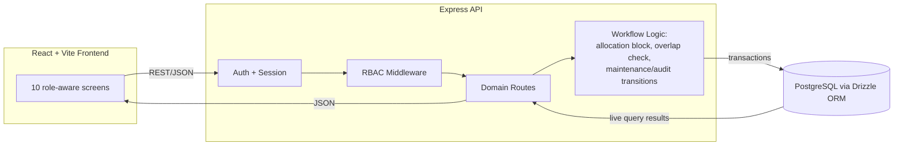
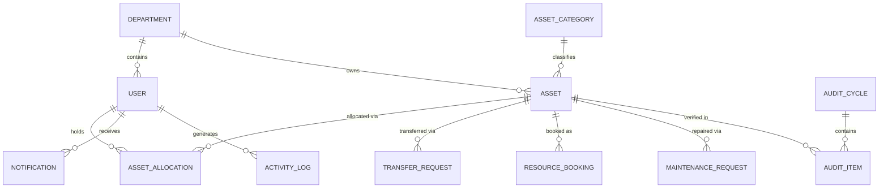

# AssetFlow

**Enterprise Asset & Resource Management System** — built in an 8-hour hackathon sprint.

AssetFlow centralizes how organizations track, allocate, and maintain physical assets and shared resources — replacing spreadsheets and paper logs with structured lifecycles, conflict-safe allocation, and real-time visibility into who holds what, where it is, and its condition.

---

## Table of Contents

- [Problem Statement](#problem-statement)
- [Key Features](#key-features)
- [Tech Stack](#tech-stack)
- [Architecture](#architecture)
- [Database Schema](#database-schema)
- [Getting Started](#getting-started)
- [Demo Credentials](#demo-credentials)
- [Project Structure](#project-structure)
- [API Overview](#api-overview)
- [For Judges — Quick Verification Checklist](#for-judges--quick-verification-checklist)
- [Team & Contribution](#team--contribution)
- [Development Process & Commit Discipline](#development-process--commit-discipline)
- [Known Limitations / Out of Scope](#known-limitations--out-of-scope)
- [License](#license)

---

## Problem Statement

Any organization with equipment, furniture, vehicles, or shared spaces (offices, schools, hospitals, factories, agencies) needs to know who has what, whether a shared room/resource is free, and whether an asset is due for maintenance or overdue for return. AssetFlow delivers this as a single ERP module — asset lifecycle, allocation, resource booking, maintenance workflow, and audit cycles — without touching purchasing, invoicing, or accounting.

Full product spec: see [`AssetFlow_PRD.md`](./AssetFlow_PRD.md).

---

## Key Features

- **Role-based access control** — Admin, Asset Manager, Department Head, Employee, each with distinct permissions enforced server-side (not just hidden UI).
- **Non-self-elevating accounts** — public signup creates an Employee account only; roles are promoted exclusively by an Admin from the Employee Directory.
- **Asset lifecycle tracking** — Available → Allocated → Reserved → Under Maintenance → Lost/Retired/Disposed, with every transition driven by an actual workflow action, never set directly.
- **Double-allocation block** — attempting to allocate an already-held asset is rejected server-side, names the current holder, and offers a Transfer Request instead of a dead end.
- **Booking overlap validation** — shared/bookable resources reject overlapping time-slot requests; back-to-back bookings are correctly allowed.
- **Maintenance approval workflow** — Pending → Approved/Rejected → Technician Assigned → In Progress → Resolved, with the asset's status auto-updating on approval and resolution.
- **🤖 AI-powered natural language asset search** — type queries like _"show available laptops in the IT department"_ and the Groq LLM (`llama3-8b-8192`) extracts structured filters (category, department, status, condition) to query the database. Accessible via the "Smart Search" bar in the Asset Directory.
- **🤖 AI predictive maintenance diagnostics** — submit a maintenance issue description and the Groq AI auto-classifies its priority (`low`/`medium`/`high`/`critical`) and suggests immediate troubleshooting steps. Triggered via the "AI Auto-Diagnose" button on the Maintenance screen.
- **QR code generation** — each asset gets a dynamically generated QR code (via the `qrcode` library), displayed in the Asset Detail Sheet for quick identification and scanning.
- **Asset Detail Sheet** — clicking any asset opens a slide-over panel showing full asset metadata, QR code, and complete maintenance history.
- **Light / Dark theme toggle** — system-aware theme switching (via `next-themes`) with a toggle button in the app shell header. Supports light, dark, and system-preference modes.
- **CSV report export** — one-click export of utilization reports as `.csv` files from the Analytics & Reports page.
- **Audit cycles** — scoped by department/location, multi-auditor assignment, auto-generated discrepancy report, and a transactional "Close Cycle" that cascades missing items to `Lost` status.
- **Live dashboard & reports** — KPIs, overdue-return alerts, utilization and maintenance-frequency analytics, idle asset detection — all computed from live database queries, not static fixtures.
- **Tamper-evident activity log** — each log entry is hash-chained to the previous one, with a "Verify Integrity" check to detect tampering.
- **Notifications** — asset assignment, approvals, booking confirmations/cancellations, overdue alerts, and audit discrepancies all surface in a unified feed.

---

## Tech Stack

| Layer | Choice |
|---|---|
| Frontend | React 19 (Vite) + TypeScript + Tailwind CSS |
| Backend | Node.js + Express 5 + TypeScript |
| Database | PostgreSQL |
| ORM | Drizzle ORM (schema-as-code + migrations) |
| Auth | express-session + bcrypt (no third-party auth provider) |
| API Client | OpenAPI 3.1 spec + Orval codegen → React Query hooks + Zod schemas |
| AI / LLM | Groq SDK (`llama3-8b-8192`) — NL asset search & maintenance diagnostics |
| Validation | Zod (generated from OpenAPI spec) |
| Charts | Recharts |
| QR Codes | `qrcode` (server-side DataURL generation) |
| Theming | `next-themes` (light / dark / system) |
| Monorepo | pnpm workspaces |
| Design System | Custom dark/hazard-accent system — see [`design.md`](./design.md) |

> **Note:** The Groq API requires a free API key (`GROQ_API_KEY` in `.env`). All other components run fully offline.

---

## Architecture



All business rules (double-allocation block, booking overlap, workflow transitions, audit-close cascade) live server-side. The frontend does not decide these outcomes — it only renders what the API returns.

### Architecture summary

- `artifacts/api-server/` — Express 5 + TypeScript REST API
- `artifacts/assetflow/` — React + Vite + Tailwind frontend SPA
- `lib/db/` — Drizzle ORM schema + PostgreSQL pool
- `lib/api-spec/` — OpenAPI 3.1 spec + Orval codegen config
- `lib/api-client-react/` — generated React query hooks
- `lib/api-zod/` — generated Zod validators

### Auth
Plain `express-session` + `bcrypt`. Sessions are stored in PostgreSQL via `connect-pg-simple`. No OAuth provider is used. Role assignment is server-enforced on signup (`employee`); admins promote via the Org > Employees tab.

### Double-allocation guard
`POST /api/allocations` checks `assets.status !== 'available'` before inserting. If blocked, it returns HTTP 409 with `{ error, currentHolderName, currentHolderDepartment, allocationId }`. The frontend shows this as a blocked banner with a "Request Transfer" CTA.

### Booking overlap check
`POST /api/bookings` queries for existing bookings where `start_time < newEnd AND end_time > newStart` with status `in ('upcoming', 'ongoing')`. Exact adjacency (`new start == existing end`) is allowed. Conflicts return HTTP 409 with `conflictingBookings[]`.

### Maintenance state machine
```
pending → approved → technician_assigned → in_progress → resolved
pending → rejected
```
Approving a maintenance request sets `assets.status = 'under_maintenance'`. Resolving it sets `assets.status = 'available'` in a transaction.

### Transfer workflow
`POST /api/transfer-requests` captures `fromEmployeeId` from the current active allocation. `PATCH .../approve` runs a transaction: closes the existing allocation, opens a new one for `toEmployeeId`, and marks the transfer approved.

### Audit cycle close
`POST /api/audit-cycles/:id/close` runs a transaction: closes the cycle, then bulk-updates assets with `verificationStatus = 'missing'` to `assets.status = 'lost'`.

### Activity log integrity
Each entry hashes `{ userId, action, entityType, entityId, metadata, ts }` with SHA-256 and stores the result in `entry_hash`. The `prev_hash` field is reserved for future tamper-evidence chaining.

---

## Database Schema

Full DDL is in [`AssetFlow_PRD.md`](./AssetFlow_PRD.md) §7 and mirrored in `/db/schema.ts` (Drizzle). Core entities:



Design notes: every workflow (allocation, transfer, booking, maintenance, audit) has its own table rather than overloading `assets` with workflow columns — deliberate 3NF discipline, not an oversight.

---

## Getting Started

```bash
# 1. Clone
git clone <repo-url>
cd assetflow

# 2. Install dependencies
npm install

# 3. Configure environment
cp .env.example .env
# Set DATABASE_URL to your Postgres instance (Replit provisions this automatically)
# Set SESSION_SECRET to any random string

# 4. Run migrations
npm run db:migrate

# 5. Seed demo data (departments, employees, assets, bookings, maintenance requests, one admin)
npm run db:seed

# 6. Start the app (backend + frontend)
npm run dev
```

The app will be available at `http://localhost:5000` (or the Replit-assigned URL). Backend runs on `/api/*`, frontend serves the React app.

---

## Demo Credentials

Seeded by `npm run db:seed`:

| Role | Email | Password |
|---|---|---|
| Admin | `admin@assetflow.dev` | `AssetFlow@2026` |

Additional employee/manager/department-head accounts are seeded with predictable emails (`employee1@assetflow.dev`, etc.) — see `db/seed.ts` for the full list and passwords.

> Change or rotate these before any real deployment. They exist purely for hackathon demo purposes.

---

## Project Structure

This is a **pnpm monorepo**. Key workspace packages:

```
Odoo-X-Team-Error-404-/
├── artifacts/
│   ├── api-server/              # Express 5 + TypeScript REST API
│   │   └── src/
│   │       ├── routes/           # Domain routes (assets, allocations, bookings, maintenance, audits, reports, transfers, users)
│   │       └── lib/              # Auth middleware, RBAC, activity logger, notifications
│   └── assetflow/               # React 19 + Vite + Tailwind frontend SPA
│       └── src/
│           ├── pages/            # 11 screens (Dashboard, Org, Assets, Allocations, Bookings, Maintenance, Audit, Reports, Notifications, Auth, AssetDetail)
│           ├── components/       # UI components (shadcn/ui), ThemeToggle, layout Shell
│           └── lib/              # Utility helpers
├── lib/
│   ├── db/                      # Drizzle ORM schema + PostgreSQL pool + seed
│   ├── api-spec/                # OpenAPI 3.1 spec + Orval codegen config
│   ├── api-client-react/        # Generated React Query hooks (via Orval)
│   └── api-zod/                 # Generated Zod validators (via Orval)
├── scripts/                     # Build & utility scripts
├── assetflow.md                 # Full product requirements document
├── security_and_code_audit.md   # Security audit report
├── pnpm-workspace.yaml          # Workspace configuration
└── README.md                    # You are here
```

---

## API Overview

Full endpoint list in [`AssetFlow_PRD.md`](./AssetFlow_PRD.md) §8. Grouped summary:

```
/auth/*                      signup, login, logout, session check
/departments, /categories    org setup (admin-gated writes)
/users                       list, promote roles, activate/deactivate
/assets                      register, search/filter, detail + history
/assets/smart-search         🤖 AI natural language search (Groq LLM)
/assets/:id/qrcode           QR code generation (DataURL)
/allocations                 allocate (409 on conflict), return
/transfer-requests           request, approve, reject
/bookings                    create (409 on overlap), cancel
/maintenance-requests        raise, approve/reject, assign technician, resolve
/maintenance-requests/diagnose  🤖 AI predictive diagnostics (Groq LLM)
/audit-cycles                create, verify item, close (transactional cascade)
/reports/*                   utilization, maintenance frequency, idle assets, booking heatmap
/notifications, /activity-logs
```

---

## For Judges — Quick Verification Checklist

A fast way to see the core business logic actually enforced, not just described:

1. **Double-allocation block:** Log in as an Asset Manager, allocate any `Available` asset to an employee. Try to allocate the same asset to a different employee — the app blocks it, names the current holder, and offers a Transfer Request instead of failing silently.
2. **Booking overlap validation:** Book a shared resource (e.g. a meeting room) for a time slot. Try to book the same resource for an overlapping slot — rejected. Try a slot that starts exactly when the first ends — accepted.
3. **Role enforcement:** Log in as an Employee and attempt to hit an admin-only or asset-manager-only action directly via the API (not just the hidden UI button) — it returns 403.
4. **Maintenance → asset status coupling:** Approve a maintenance request and check the asset's status flips to `Under Maintenance` automatically; resolve it and confirm it reverts to `Available`.
5. **Audit close cascade:** Mark an audit item `Missing`, close the audit cycle, and confirm the underlying asset's status becomes `Lost` — done as a single transaction, not a manual follow-up step.
6. **Activity log integrity:** Use the "Verify Integrity" action on the Activity Log screen to confirm the hash chain is intact.

---

## Team & Contribution

| Member | Focus Area | Key Modules |
|---|---|---|
| _[Name]_ | Database & Auth | Schema, migrations, seed data, session auth, RBAC middleware |
| _[Name]_ | Backend Workflows | Allocation/transfer logic, booking overlap logic, maintenance & audit endpoints, activity log hash-chain |
| _[Name]_ | Frontend Core | Design system setup, layout shell, Dashboard, Org Setup, Asset Directory |
| _[Name]_ | Frontend Workflows | Allocation/Transfer UI, Booking calendar, Maintenance kanban, Audit UI, Reports, Notifications |

*(Fill in names before submission — this table doubles as the map judges use to cross-reference commit authorship against module ownership.)*

---

## Development Process & Commit Discipline

This project was built in a single 8-hour sprint (9 AM–5 PM) by a 4-person team. To keep the git history a genuine, checkable record of who built what (not a single end-of-day dump):

- **Commit cadence:** every member commits at least once per hour, scoped to a single logical change.
- **Commit message convention** ([Conventional Commits](https://www.conventionalcommits.org/)):
  - `feat: add booking overlap validation`
  - `fix: correct double-allocation 409 response shape`
  - `chore: seed demo maintenance requests`
  - `docs: update README setup steps`
  - `refactor: extract RBAC check into middleware`
- **Branching:** short-lived feature branches (`feat/booking-overlap`, `feat/audit-cycle-ui`) merged into `main` every 1–2 hours, or direct-to-`main` commits if the team prefers speed over review overhead — either is fine, but pick one and stay consistent.
- **Why this matters here:** GitHub activity (commit frequency, message quality, branch usage) is an explicit judging input for this round — treat the commit log itself as a deliverable, not just the running app.

---

## Known Limitations / Out of Scope

Deliberately deferred to protect the 8-hour timeline — documented here rather than left unexplained:

- No real file/photo upload — asset and maintenance-request photos use a plain URL field.
- No QR-code camera scanning — QR codes are generated and displayed, but not scanned via camera.
- No email delivery — notifications are in-app only.
- No password-reset email flow — UI stub only.
- No drag-and-drop on the Kanban board or booking calendar — status changes are button-driven.
- No automated test suite — verified via the manual checklist above.
- Activity-log tamper-evidence uses a hash chain, not a distributed ledger — a scoped, honest analog to "blockchain," not a literal blockchain integration.

Full rationale for these cuts: see [`assetflow.md`](./assetflow.md) §12 (MoSCoW).

---

## License

Built for hackathon evaluation purposes. Add a license here if the project continues past the event (MIT is a reasonable default for hackathon code).
