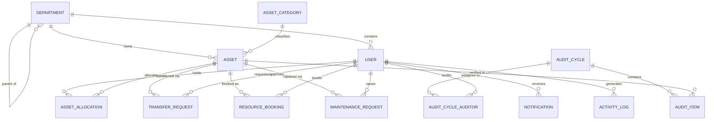
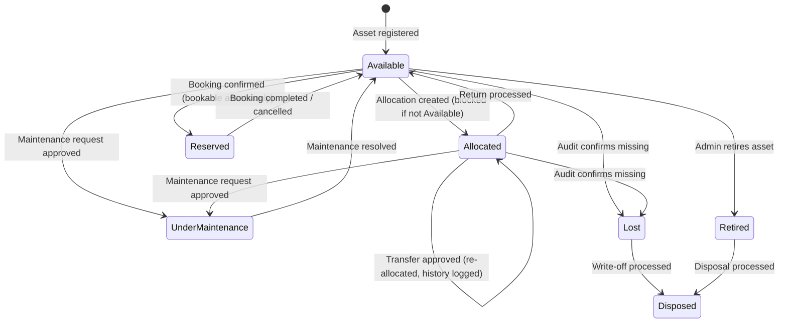
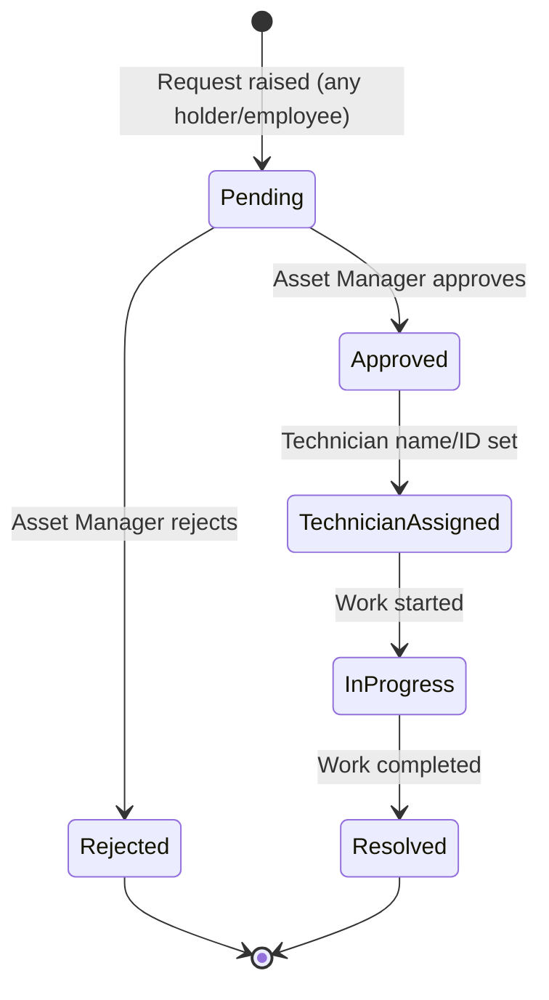
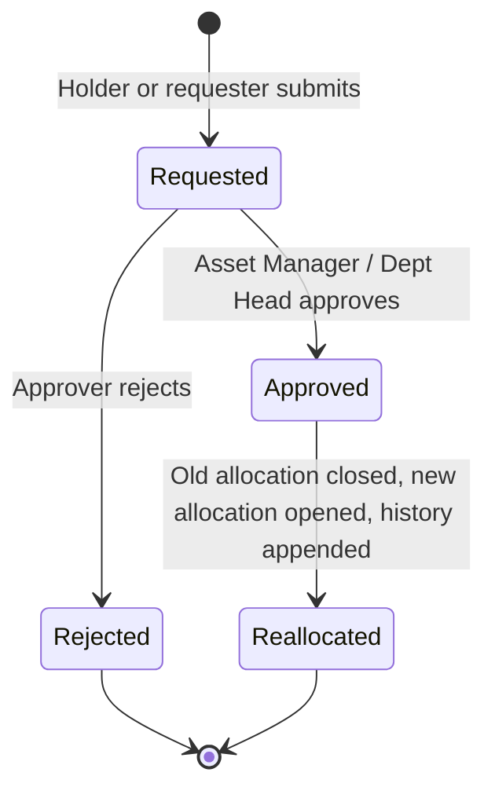

# AssetFlow — Product Requirements Document
### Enterprise Asset & Resource Management System
**Prepared for:** Hackathon virtual round (8 hrs, 9 AM–5 PM, 4-person team)
**Status:** Build-ready

---

## 0. Read This First — Scope Reality Check

The problem statement describes a full ERP: 4 roles, 10 screens, 5 stateful workflows, conflict-detection logic, audit cycles, analytics, and notifications. That's a 2–3 week product scoped into an 8-hour build. It is achievable, but **only if you cut before you start, not at hour 6 when you're panicking.**

The rest of this PRD is complete and detailed on purpose — an AI build agent needs the full picture to generate coherent code. But your team should build in the order defined in §12 (MoSCoW), and treat §12's "Won't-have" list as already decided, not up for debate mid-hackathon.

**The one rule that matters most:** judges evaluate database design, logic, and security as heavily as UI. Do not let 4 people spend 6 hours on pixel-polish and 1 hour on schema — the schema in §7 is the backbone every other module depends on, and it should be locked and migrated in hour 1.

---

## 1. Vision & Problem Statement

Organizations track physical assets (laptops, furniture, vehicles, rooms) and shared resources through spreadsheets and paper logs. This causes lost accountability (who has what), double-booking of shared spaces, untracked maintenance, and no audit trail. AssetFlow centralizes this into one ERP module: departments → employees → assets → allocations/bookings → maintenance → audits, with role-based workflows and real-time visibility.

**Explicitly out of scope:** purchasing, invoicing, accounting, payroll. AssetFlow tracks *physical custody and condition*, not financial transactions (acquisition cost is stored only for reporting/ranking, never linked to a ledger).

---

## 2. User Roles & Permission Matrix

| Capability | Admin | Asset Manager | Department Head | Employee |
|---|---|---|---|---|
| Sign up (creates Employee account) | — | — | — | ✅ (self) |
| Promote user to Dept Head / Asset Manager | ✅ | ❌ | ❌ | ❌ |
| Create/edit departments, categories | ✅ | ❌ | ❌ | ❌ |
| Register new assets | ❌ | ✅ | ❌ | ❌ |
| Allocate / re-allocate assets | ❌ | ✅ | ✅ (own dept only) | ❌ |
| Request transfer of asset held by them | ❌ | ✅ | ✅ | ✅ |
| Approve transfer requests | ❌ | ✅ | ✅ (own dept only) | ❌ |
| Book shared resources | ✅ | ✅ | ✅ (on behalf of dept) | ✅ |
| Raise maintenance request | ✅ | ✅ | ✅ | ✅ (on assets held by them) |
| Approve/reject maintenance requests | ❌ | ✅ | ❌ | ❌ |
| Create & assign audit cycles | ❌ | ✅ | ❌ | ❌ |
| Verify assets during audit (as assignee) | ❌ | ✅ | ✅ | ✅ (if assigned as auditor) |
| Close audit cycle | ❌ | ✅ | ❌ | ❌ |
| View org-wide analytics/reports | ✅ | ✅ | ❌ (dept-scoped only) | ❌ |
| View own allocated assets & notifications | ✅ | ✅ | ✅ | ✅ |

**Critical security rule:** every write endpoint must re-check role + ownership server-side. The frontend hiding a button is not access control — the API must reject unauthorized requests with 403, independent of what the UI shows. This is a judged criterion (security) and the easiest place to lose points silently.

---

## 3. Signup / Account Creation Rule (Anti-privilege-escalation)

This is explicitly called out in the problem statement and is an easy, high-signal thing to get right for judges:

- Public signup form creates a `role = 'employee'` account **only**. There is no role selector on the signup form, full stop — not even a disabled one.
- The **first** admin account must be seeded via a database seed script (not through the UI) — document this clearly in your README so judges can log in as admin on demo.
- Admin promotes existing employees to `department_head` or `asset_manager` exclusively from the Employee Directory (Screen 3, Tab C). This is the *only* code path that can change a user's role.
- Server-side: the `PATCH /users/:id/role` endpoint must itself be gated to `role === 'admin'`, independent of the frontend.

---

## 4. Core Entities & Relationships



---

## 5. Asset Lifecycle — State Machine (source of truth)



**Enforcement rule:** status transitions are *never* set directly by the frontend. They are always a side effect of a workflow action (allocate, return, approve maintenance, resolve maintenance, close audit, etc.) computed server-side. This keeps the state machine deterministic and prevents illegal states (e.g. a "Retired" asset getting booked).

### 5.1 Maintenance Workflow


Asset status flips to `Under Maintenance` on **Approved** (not on request — a pending request shouldn't lock the asset), and back to `Available` on **Resolved**.

### 5.2 Transfer Workflow



### 5.3 Resource Booking Status
`Upcoming → Ongoing → Completed` (time-driven, computed from `NOW()` vs. `start_time`/`end_time`, not manually set) and `Upcoming → Cancelled` (user action, only before `start_time`).

---

## 6. Screen-by-Screen Functional Spec

### Screen 1 — Login / Signup
- Email + password login. Bcrypt-hashed passwords, server-side session (or short-lived JWT) — no third-party auth provider.
- Signup: name, email, password → creates `role='employee'`, `status='active'` account. No department selection at signup (assign later via Org Setup, or add optional self-select department with `status='pending'` — pick one, document it).
- "Forgot password" can be a stub for the hackathon (documented as out-of-scope for 8hr build) — don't burn time on email delivery infra.
- Validation: email format, password min length (8), duplicate-email check with a clear inline error (not a generic 500).

### Screen 2 — Dashboard
- KPI cards (server-computed, not hardcoded): Assets Available, Assets Allocated, Maintenance Today, Active Bookings, Pending Transfers, Upcoming Returns.
- **Overdue returns** shown in a distinct alert-styled block, separate from the KPI grid — query: `asset_allocations WHERE status='active' AND expected_return_date < NOW()`.
- Quick actions: Register Asset (Asset Manager/Admin only — hide for Employee), Book Resource, Raise Maintenance Request.
- Recent Activity feed: last N rows from `activity_logs`, scoped to what the current role is allowed to see.
- Role-aware: Employee sees only their own allocations/bookings reflected in relevant cards; Admin/Asset Manager sees org-wide; Dept Head sees dept-scoped.

### Screen 3 — Organization Setup (Admin only, 3 tabs)
**Tab A — Departments:** CRUD, fields: name, head (dropdown of users), parent department (self-referencing, optional), status. Editing a department here must immediately reflect in every dropdown elsewhere (Screen 4 filters, Screen 5 "To" selector) — this is a live foreign-key relationship, not a cached list.
**Tab B — Asset Categories:** CRUD, fields: name, optional category-specific fields stored as JSONB (e.g. `{"warranty_months": 24}` for Electronics) so the schema doesn't need a new column per category.
**Tab C — Employee Directory:** list all users (name, email, department, role, status). Admin action: "Promote to Department Head" / "Promote to Asset Manager" / "Deactivate". This is the only role-change surface in the app (§3).

### Screen 4 — Asset Registration & Directory
- Register form: Name, Category (dropdown from Screen 3B), auto-generated Asset Tag (`AF-####`, sequential, server-generated — never client-generated to avoid collisions), Serial Number, Acquisition Date, Acquisition Cost, Condition, Location, photo (URL/upload stub), `is_bookable` flag.
- Directory: searchable/filterable table (tag, serial, category, status, department, location). Search should hit the DB with an indexed `ILIKE`/full-text query, not a full table dump filtered client-side, once data volume matters (even for demo data, build it right for the code-quality score).
- Per-asset detail drawer: full allocation history + maintenance history (joined queries, chronological).
- Status badge colored per the design system's tile-fill logic (see design.md §4 pill tags).

### Screen 5 — Asset Allocation & Transfer (double-allocation block)
- Search/select an asset → attempt allocation to an employee/department with optional expected return date.
- **If asset.status ≠ 'Available':** block with an inline error naming the current holder, and surface a "Transfer Request" CTA instead of a dead end. This exact interaction (red banner + transfer CTA) is explicitly called out in the wireframe and problem statement — implement it precisely, it's a marked example in the spec.
- Transfer request flow: Requested → Approved/Rejected → Reallocated (§5.2). On approval, old `asset_allocations` row is closed (`status='returned'`, `returned_at=NOW()`), a new one opened, and both appear in the allocation history list.
- Return flow: mark returned, capture condition check-in notes (free text), asset status reverts to `Available`.
- Allocation history panel: reverse-chronological list of every allocation/return/transfer for the selected asset.

### Screen 6 — Resource Booking (overlap validation)
- Calendar/timeline view of a single bookable resource's existing bookings for a selected day.
- Booking form: purpose, start time, end time.
- **Overlap rule (implement exactly):** reject if `new.start_time < existing.end_time AND new.end_time > existing.start_time` for any existing booking with status in `('upcoming','ongoing')`. Back-to-back bookings (new start == existing end) are **allowed** — this exact edge case is named in the problem statement, get it right.
- Cancel (only if `status='upcoming'`), no reschedule-drag-and-drop needed for MVP — a cancel + rebook flow is acceptable and saves hours.

### Screen 7 — Maintenance Management (Kanban)
- Columns: Pending → Approved → Technician Assigned → In Progress → Resolved (§5.1). Rejected requests can live in a collapsed/filtered state, not a visible column, to keep the board clean.
- Card: asset tag/name, short issue description, priority badge, assigned technician (once set).
- Moving a card (drag or button-based status change) triggers the corresponding backend transition + asset status side effect (§5.1). Drag-and-drop is a nice-to-have; a simple "Approve / Reject / Assign / Resolve" button per card is a safe, faster-to-build equivalent — do buttons first, add drag only if time remains.
- Raise-request form (separate modal/screen): asset selector (scoped to assets the requester holds, or any asset for Asset Manager/Admin), issue description, priority, photo (stub).

### Screen 8 — Asset Audit
- Create Audit Cycle: name, scope (department and/or location), date range, assign one or more auditors (multi-select users).
- Auditor view: checklist of in-scope assets with expected location, marking each `Verified / Missing / Damaged` + notes.
- On any `Missing`/`Damaged` mark, auto-append to a discrepancy list (derived from `audit_items`, not a separately maintained table — compute it with a filtered query).
- "Close Audit Cycle": locks all `audit_items` (no further edits), and for every `Missing` item, cascades `assets.status = 'Lost'`. This cascade is a real, judged piece of business logic — implement it as a single transactional server action, not a frontend loop of individual PATCH calls.

### Screen 9 — Reports & Analytics
- Utilization by department (bar chart), maintenance frequency by category (line/bar chart) — both computed via `GROUP BY` aggregate queries, not client-side math over a full dump.
- Most-used assets / idle assets — rank by booking count / allocation duration vs. days since last activity.
- Assets due for maintenance or nearing retirement (heuristic: age > N years or maintenance count > N in last 6 months).
- Department-wise allocation summary table.
- Booking heatmap (peak usage windows) — a simple day-of-week × hour grid is sufficient; don't over-engineer this into a full calendar heatmap library.
- Export report (CSV export of the current view is enough — a PDF renderer is a time sink, skip unless hours remain).

### Screen 10 — Activity Logs & Notifications
- Notification feed, filterable by type (All / Alerts / Approvals / Bookings), with read/unread state.
- Notification-triggering events (create a row in `notifications` on each): Asset Assigned, Maintenance Approved/Rejected, Booking Confirmed/Cancelled/Reminder, Transfer Approved, Overdue Return Alert, Audit Discrepancy Flagged.
- Full activity log: every write action logged with actor, action, entity, timestamp — this is your audit trail and doubles as your "who did what when" security answer to judges.

---

## 7. Database Schema (PostgreSQL — authoritative)

```sql
-- Users & Org structure
CREATE TABLE departments (
  id SERIAL PRIMARY KEY,
  name VARCHAR(120) NOT NULL,
  head_user_id INT REFERENCES users(id),
  parent_department_id INT REFERENCES departments(id),
  status VARCHAR(10) NOT NULL DEFAULT 'active' CHECK (status IN ('active','inactive')),
  created_at TIMESTAMPTZ DEFAULT NOW()
);

CREATE TABLE users (
  id SERIAL PRIMARY KEY,
  name VARCHAR(120) NOT NULL,
  email VARCHAR(160) UNIQUE NOT NULL,
  password_hash TEXT NOT NULL,
  role VARCHAR(20) NOT NULL DEFAULT 'employee'
    CHECK (role IN ('admin','asset_manager','department_head','employee')),
  department_id INT REFERENCES departments(id),
  status VARCHAR(10) NOT NULL DEFAULT 'active' CHECK (status IN ('active','inactive')),
  created_at TIMESTAMPTZ DEFAULT NOW(),
  updated_at TIMESTAMPTZ DEFAULT NOW()
);
-- circular FK: add departments.head_user_id -> users.id after users table exists (or defer constraint)

CREATE TABLE asset_categories (
  id SERIAL PRIMARY KEY,
  name VARCHAR(80) NOT NULL,
  extra_fields JSONB DEFAULT '{}',
  created_at TIMESTAMPTZ DEFAULT NOW()
);

CREATE TABLE assets (
  id SERIAL PRIMARY KEY,
  asset_tag VARCHAR(20) UNIQUE NOT NULL,       -- AF-0001, server-generated sequence
  name VARCHAR(150) NOT NULL,
  category_id INT REFERENCES asset_categories(id),
  serial_number VARCHAR(100),
  acquisition_date DATE,
  acquisition_cost NUMERIC(12,2),
  condition VARCHAR(20) DEFAULT 'good' CHECK (condition IN ('excellent','good','fair','poor')),
  location VARCHAR(120),
  photo_url TEXT,
  is_bookable BOOLEAN DEFAULT false,
  status VARCHAR(20) NOT NULL DEFAULT 'available'
    CHECK (status IN ('available','allocated','reserved','under_maintenance','lost','retired','disposed')),
  department_id INT REFERENCES departments(id),
  created_at TIMESTAMPTZ DEFAULT NOW(),
  updated_at TIMESTAMPTZ DEFAULT NOW()
);
CREATE INDEX idx_assets_status ON assets(status);
CREATE INDEX idx_assets_tag_serial ON assets(asset_tag, serial_number);

CREATE TABLE asset_allocations (
  id SERIAL PRIMARY KEY,
  asset_id INT NOT NULL REFERENCES assets(id),
  employee_id INT NOT NULL REFERENCES users(id),
  department_id INT REFERENCES departments(id),
  allocated_at TIMESTAMPTZ DEFAULT NOW(),
  expected_return_date DATE,
  returned_at TIMESTAMPTZ,
  return_condition_notes TEXT,
  status VARCHAR(15) NOT NULL DEFAULT 'active' CHECK (status IN ('active','returned')),
  created_by INT REFERENCES users(id)
);
CREATE INDEX idx_allocations_asset_status ON asset_allocations(asset_id, status);

CREATE TABLE transfer_requests (
  id SERIAL PRIMARY KEY,
  asset_id INT NOT NULL REFERENCES assets(id),
  from_employee_id INT REFERENCES users(id),
  to_employee_id INT NOT NULL REFERENCES users(id),
  reason TEXT,
  status VARCHAR(15) NOT NULL DEFAULT 'requested' CHECK (status IN ('requested','approved','rejected')),
  requested_by INT REFERENCES users(id),
  approved_by INT REFERENCES users(id),
  requested_at TIMESTAMPTZ DEFAULT NOW(),
  resolved_at TIMESTAMPTZ
);

CREATE TABLE resource_bookings (
  id SERIAL PRIMARY KEY,
  asset_id INT NOT NULL REFERENCES assets(id),   -- must have is_bookable = true
  booked_by INT NOT NULL REFERENCES users(id),
  department_id INT REFERENCES departments(id),
  purpose VARCHAR(200),
  start_time TIMESTAMPTZ NOT NULL,
  end_time TIMESTAMPTZ NOT NULL,
  status VARCHAR(15) NOT NULL DEFAULT 'upcoming'
    CHECK (status IN ('upcoming','ongoing','completed','cancelled')),
  created_at TIMESTAMPTZ DEFAULT NOW(),
  CHECK (end_time > start_time)
);
CREATE INDEX idx_bookings_asset_time ON resource_bookings(asset_id, start_time, end_time);

CREATE TABLE maintenance_requests (
  id SERIAL PRIMARY KEY,
  asset_id INT NOT NULL REFERENCES assets(id),
  raised_by INT NOT NULL REFERENCES users(id),
  issue_description TEXT NOT NULL,
  priority VARCHAR(10) NOT NULL DEFAULT 'medium' CHECK (priority IN ('low','medium','high','critical')),
  photo_url TEXT,
  status VARCHAR(25) NOT NULL DEFAULT 'pending'
    CHECK (status IN ('pending','approved','rejected','technician_assigned','in_progress','resolved')),
  assigned_technician VARCHAR(120),
  approved_by INT REFERENCES users(id),
  resolved_at TIMESTAMPTZ,
  created_at TIMESTAMPTZ DEFAULT NOW(),
  updated_at TIMESTAMPTZ DEFAULT NOW()
);

CREATE TABLE audit_cycles (
  id SERIAL PRIMARY KEY,
  name VARCHAR(150) NOT NULL,
  scope_department_id INT REFERENCES departments(id),
  scope_location VARCHAR(120),
  start_date DATE NOT NULL,
  end_date DATE NOT NULL,
  status VARCHAR(15) NOT NULL DEFAULT 'planned' CHECK (status IN ('planned','in_progress','closed')),
  created_by INT REFERENCES users(id),
  closed_at TIMESTAMPTZ
);

CREATE TABLE audit_cycle_auditors (
  audit_cycle_id INT REFERENCES audit_cycles(id),
  auditor_id INT REFERENCES users(id),
  PRIMARY KEY (audit_cycle_id, auditor_id)
);

CREATE TABLE audit_items (
  id SERIAL PRIMARY KEY,
  audit_cycle_id INT NOT NULL REFERENCES audit_cycles(id),
  asset_id INT NOT NULL REFERENCES assets(id),
  expected_location VARCHAR(120),
  verification_status VARCHAR(15) NOT NULL DEFAULT 'pending'
    CHECK (verification_status IN ('pending','verified','missing','damaged')),
  notes TEXT,
  verified_by INT REFERENCES users(id),
  verified_at TIMESTAMPTZ
);

CREATE TABLE notifications (
  id SERIAL PRIMARY KEY,
  user_id INT NOT NULL REFERENCES users(id),
  type VARCHAR(40) NOT NULL,
  message TEXT NOT NULL,
  reference_type VARCHAR(40),
  reference_id INT,
  is_read BOOLEAN DEFAULT false,
  created_at TIMESTAMPTZ DEFAULT NOW()
);
CREATE INDEX idx_notifications_user_unread ON notifications(user_id, is_read);

CREATE TABLE activity_logs (
  id SERIAL PRIMARY KEY,
  user_id INT REFERENCES users(id),
  action VARCHAR(60) NOT NULL,
  entity_type VARCHAR(40) NOT NULL,
  entity_id INT,
  metadata JSONB DEFAULT '{}',
  prev_hash CHAR(64),                 -- tamper-evident chain, see PRD §11
  entry_hash CHAR(64) NOT NULL,
  created_at TIMESTAMPTZ DEFAULT NOW()
);
```

**Normalization note for judges:** every many-to-many relationship (auditors↔cycles) uses a join table; every workflow (allocation, transfer, maintenance, audit) has its own table rather than overloading `assets` with workflow columns — this is deliberate 3NF discipline and worth stating explicitly in your submission write-up.

---

## 8. API Surface (REST, grouped)

```
POST   /auth/signup                     -> creates employee account only
POST   /auth/login
POST   /auth/logout
GET    /auth/me

GET    /departments        POST /departments        PATCH /departments/:id
GET    /categories         POST /categories          PATCH /categories/:id
GET    /users              PATCH /users/:id/role     PATCH /users/:id/status   [admin only]

GET    /assets?search=&status=&category=&department=
POST   /assets                          [asset_manager, admin]
GET    /assets/:id                      -> includes allocation + maintenance history
PATCH  /assets/:id

POST   /allocations                     -> blocked server-side if asset not Available
POST   /allocations/:id/return
POST   /transfer-requests
PATCH  /transfer-requests/:id/approve
PATCH  /transfer-requests/:id/reject

GET    /bookings?assetId=&date=
POST   /bookings                        -> server-side overlap check, 409 on conflict
PATCH  /bookings/:id/cancel

GET    /maintenance-requests?status=
POST   /maintenance-requests
PATCH  /maintenance-requests/:id/approve
PATCH  /maintenance-requests/:id/reject
PATCH  /maintenance-requests/:id/assign-technician
PATCH  /maintenance-requests/:id/resolve

POST   /audit-cycles
POST   /audit-cycles/:id/items/:itemId/verify
POST   /audit-cycles/:id/close          -> transactional: locks items + cascades asset status

GET    /reports/utilization
GET    /reports/maintenance-frequency
GET    /reports/idle-assets
GET    /reports/booking-heatmap

GET    /notifications?filter=
PATCH  /notifications/:id/read
GET    /activity-logs
```

All mutating endpoints: validate request body (schema validation, e.g. Zod), check role/ownership, wrap multi-step writes (audit close, transfer approval) in a DB transaction.

---

## 9. Non-Functional Requirements

- **Validation:** every form field validated both client-side (fast feedback) and server-side (source of truth). Never trust the frontend for anything security- or integrity-relevant.
- **Security:** bcrypt password hashing, server-enforced RBAC on every endpoint, parameterized queries only (ORM handles this — never string-concatenate SQL), session/JWT expiry.
- **Performance:** indexed lookups on high-traffic columns (`assets.status`, `bookings.asset_id+time range`, `notifications.user_id+is_read`) — already reflected in §7.
- **Scalability:** stateless API layer (session in DB/cookie, not in-memory server state) so it could horizontally scale; pagination on list endpoints (`assets`, `activity-logs`) instead of unbounded dumps.
- **Real-time data:** dashboard and notification counts must be live DB queries on each load (or short-poll every 15–30s) — never a static JSON fixture standing in for live data, per the hackathon brief.
- **Responsiveness:** every screen must work at the breakpoints defined in design.md §8 (mobile → tablet → desktop), matching the wireframe layouts.

---

## 10. Tech Stack (fits "MySQL/PostgreSQL only, minimal third-party API")

| Layer | Choice | Why |
|---|---|---|
| Database | PostgreSQL (Replit's built-in Postgres) | Required by brief; strong support for JSONB (category extra fields, activity metadata), CHECK constraints, transactions |
| ORM | Drizzle ORM (or Prisma) | Type-safe schema-as-code, migrations, works cleanly with Replit + Postgres |
| Backend | Node.js + Express + TypeScript | No external API dependency; easy to reason about for 4 people splitting work |
| Frontend | React (Vite) + TypeScript + Tailwind CSS | Matches design.md token system directly via Tailwind config extension |
| Auth | express-session + bcrypt (or JWT + bcrypt) | Zero third-party auth provider — satisfies "minimal third-party API" |
| Charts | Recharts | No external API calls, pure client-side rendering from your own `/reports` endpoints |
| Real-time | Short-interval polling (15–30s) on dashboard/notifications; Socket.io only as a stretch goal | Polling is simpler, safer under time pressure, and still satisfies "real-time dynamic data" |

---

## 11. "Trendy Tech" — Honest, Defensible Scope

The brief lists AI / blockchain / chatbot as bonus signals. Building any of these for real in the time left is not realistic, and a fake or flaky demo of "AI" or "blockchain" is worse than not attempting it — judges probe these first. Here's what's actually buildable and defensible:

- **"AI-assisted" insights (rule-based, not ML):** On Reports (Screen 9), flag idle assets (no activity in N days) and suggest maintenance priority from keyword matching in the issue description (e.g. "smoke", "not powering on" → `critical`). This is legitimately useful and fast to build. Be straight with judges when asked: it's a rules engine, not a trained model — that's a perfectly good answer and avoids getting caught overclaiming.
- **Tamper-evident activity log ("blockchain-inspired," not literal blockchain):** each `activity_logs` row stores a SHA-256 hash of its own payload + the previous row's hash (`prev_hash`/`entry_hash` in §7 schema). Add a "Verify Log Integrity" action on Screen 10 that recomputes the chain and flags any break. This is a real, working, explainable security feature — directly maps to the "security" judging criterion — without pretending to run an actual distributed ledger.
- **In-app assistant (deterministic, not an LLM call):** a small widget that matches user text against a fixed intent list ("how do I book a room" → deep-links to Screen 6, "check my assets" → Screen 4 filtered to mine). Zero external API dependency, zero cost, zero risk of a live demo failure from a flaky third-party call.

If a 5th "trendy tech" person magically appears or time is abundant, a genuine small classifier (e.g. logistic regression trained offline on synthetic maintenance-priority data) could replace the keyword heuristic — but don't plan the demo around it.

---

## 12. Scope Triage — MoSCoW (decide this now, not at hour 6)

**Must-have (core judged surface, do not cut):**
Auth + RBAC · Org Setup (departments/categories/employees) · Asset registration + directory + search · Allocation with double-allocation block · Resource booking with overlap validation · Maintenance kanban workflow (button-based status change is fine) · Dashboard KPIs from live queries · Fully normalized Postgres schema, migrated in hour 1.

**Should-have:**
Transfer request workflow · Audit cycle + auto-generated discrepancy report · Notifications screen · Activity log.

**Could-have (bonus points if time remains):**
Reports & analytics charts · Hash-chained activity log integrity check · Rule-based smart insights · In-app FAQ assistant · CSV export.

**Won't-have this round (cut explicitly, document as "future work" in your README):**
Real file/photo upload (use a URL text field instead) · QR-code camera scanning (text search only) · Email delivery for notifications (in-app only) · Drag-and-drop kanban/calendar (use buttons/forms) · Automated test suite (manual smoke test checklist instead) · Password-reset email flow.

---

## 13. 8-Hour Execution Plan (4 people, 9 AM–5 PM)

| Time | Member A (DB/Auth) | Member B (Backend workflows) | Member C (Frontend shell + core) | Member D (Frontend workflows) |
|---|---|---|---|---|
| 9–10 | Schema (§7) migrated, seed script (departments/categories/users incl. seeded admin) | Repo scaffold, Express + Drizzle wiring | Vite + Tailwind + design.md tokens configured, layout shell + nav | Screen wireframe → component breakdown, routing skeleton |
| 10–11 | Auth endpoints + RBAC middleware | Assets CRUD + search endpoint | Login/Signup UI, Dashboard shell | Asset Directory UI |
| 11–1 | Allocation + transfer endpoints (double-block logic) | Booking endpoints (overlap logic) + maintenance endpoints | Org Setup UI (3 tabs) + Dashboard KPIs wired | Allocation/Transfer UI + Booking calendar UI |
| 1–2 | *(lunch stagger — keep commits flowing)* | Audit cycle endpoints + notification triggers | Maintenance kanban UI | Audit cycle UI |
| 2–3 | Reports aggregate queries | Activity log + hash-chain util | Reports charts UI | Notifications UI |
| 3–4 | Bug fixes on backend logic | Smart-insights heuristics + FAQ widget | Responsive pass (breakpoints per design.md §8) | Cross-screen integration, empty/error states |
| 4–5 | Final schema/seed sanity check | Final workflow sanity check (re-test overlap + double-block) | Visual QA against design.md | Demo script + README + integrity check button |

**Commit discipline:** every member commits at minimum once per hour, small and scoped (`feat: booking overlap validation`, not one giant end-of-day commit). This is directly graded — make it visible in your GitHub history, not just true in spirit.

---

## 14. Judging Criteria → Where It's Addressed

| Criterion | Addressed by |
|---|---|
| Code standard | TypeScript throughout, Zod/schema validation, ORM (no raw SQL string concat) |
| Logic | §5 state machines, §6 double-allocation + overlap algorithms implemented server-side |
| Modularity | Separate table/endpoint per workflow (§7, §8) rather than one god-table/god-controller |
| Frontend design | Strict adherence to design.md — see companion Replit prompt |
| Performance | Indexes (§7), pagination, aggregate queries instead of client-side computation |
| Scalability | Stateless API, normalized schema, join tables for many-to-many |
| Security | RBAC middleware, bcrypt, server-side validation, hash-chained activity log (§11) |
| Usability | Wireframe-faithful screens, inline conflict messaging (Screen 5's red banner), empty/error states |
| Database design | §7 — 3NF, explicit workflow tables, CHECK constraints, no accounting bleed-through |

---

*End of PRD. See companion file `AssetFlow_Replit_Build_Prompt.md` for the single Replit Agent prompt, and `design.md` for the visual system it must follow exactly.*